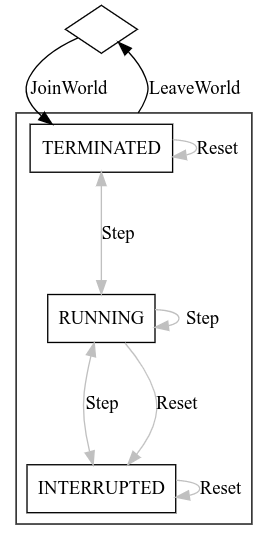
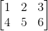
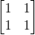

## Protocol overview

`dm_env_rpc` is a protocol for [agents](glossary.md#agent)
([clients](glossary.md#client)) to communicate with
[environments](glossary.md#environment) ([servers](glossary.md#server)). A
server has a single remote procedural call (RPC) named `Process` for handling
messages from clients.

```protobuf
service Environment {
  // Process incoming environment requests.
  rpc Process(stream EnvironmentRequest) returns (stream EnvironmentResponse) {}
}
```

`Process` is a bidirectional streaming RPC, meaning the connection stays active
over the entire life of an agent-environment session and ensures the ordering of
messages is preserved.

This RPC can support multiple streams simultaneously, so it is up to each server
implementation to determine if it can support multiple simultaneous clients, if
each client can instantiate its own [world](glossary.md#world), or if each
stream is expected to connect to the same underlying world.

Each stream accepts a [sequence](glossary.md#sequence) of `EnvironmentRequest`
messages from the client, and the server always sends exactly one
`EnvironmentResponse` for each request. The server endpoint does not send any
other messages. The payload of the response always either corresponds to that of
the request (e.g. a `StepResponse` in response to a `StepRequest`) or is an
error `Status` message.

### Streaming

Clients may speculatively send multiple requests without waiting for responses,
though each request is still required to be valid at the time it's processed.
Likewise, after processing requests the server will send back responses in the
same order as the requests were sent.

Because the connection is streamed, message order is guaranteed.

### States

An Environment connection can be in one of two states: joined to a world or not.
When not joined to a world, `StepRequest` and `ResetRequest` calls are
unavailable (the server will send an error upon receiving them).

A joined connection may be in a variety of sub-states (ie: RUNNING, TERMINATED,
and INTERRUPTED). Agents transition between these states using `StepRequest`,
`ResetRequest` and `ResetWorldRequest` calls, though the environment controls
which state is transitioned to.



### Tensors

For the purposes of this protocol tensors are loosely based on NumPy arrays:
n-dimensional arrays of data with the same data type. A tensor with "n"
dimensions can be referred to as an n-tensor. A 0-tensor is just a scalar value,
such as a single float. A 1-tensor can be thought of either as a single
dimensional array or vector. A 2-tensor is a two dimensional array or a matrix.
In principle there's no limit to the number of dimensions a tensor can have in
the protocol, but in practice we rarely have more than 3 or 4 dimensions.
Tensors are not allowed to be
[ragged](https://en.wikipedia.org/wiki/Jagged_array) (have rows with different
numbers of elements), though they may have a
[variable length](#variable-lengths) along one dimension.

A tensor's shape represents the number of elements along each dimension. A
2-tensor with a shape of `[3, 4]` would be a 2 dimensional array with 3 rows and
4 columns.

In order to pack these tensors in a way that can be sent over the network they
have to be flattened to a one dimensional array. For multidimensional tensors
it's expected that they will be packed in a row-major format. That is, the
values at indices `[2, 3, 4]` and `[2, 3, 5]` are located next to each other in
the flattened array. This is the default memory layout in C based languages,
such as C/C++, Java, and C#, and NumPy in Python and TensorFlow, but is opposite
to how column-major languages work, such as Fortran.

Consult the
[Row- and column-major order](https://en.wikipedia.org/wiki/Row-_and_column-major_order)
article for more information.

#### Variable lengths:

Normally a tensor has a well defined shape. However, if one of the elements in a
Tensor's shape is negative it represents a variable dimension. Either the client
or the server, upon receiving a Tensor message with a Shape with a negative
element, will attempt to infer the correct value for the shape based on the
number of elements in the Tensor's array part and the rest of the shape.

Note: even though this dimension has variable length, the tensor itself is still
not ragged. The variable dimension has a definite length that can be inferred.

For instance, a Tensor with shape `[2, -1]` represents a variable length
2-tensor with two rows and a variable number of columns. If this Tensor's array
part contains 6 elements `[1, 2, 3, 4, 5, 6]` then the final produced 2-tensor
will look like:



Variable length tensors are useful for situations where a given observation or
action's length is unknowable from frame to frame. For instance, the number of
words in a sentence or the number of stochastic events in a given time frame.

Note: At most one dimension is allowed to be variable on a given tensor.

Note: servers should provide actions and observations with non-variable length
if possible, as it can reduce the complexity of agent implementations.

#### Broadcastable

If a tensor contains all elements of the same value, it is "broadcastable" and
can be represented with a single value in the array part of the Tensor, even if
the shape requires more elements. Either the client or server, upon receiving a
broadcastable tensor, will unpack it to an appropriately sized multidimensional
array with each element being set to the value from the lone element in the
array part of the Tensor.

For instance, a Tensor with Shape `[2, 2]` and a single element `1` in its array
part will produce a 2-tensor that looks like:



#### TensorSpec

A `TensorSpec` provides metadata about a tensor, such as its name, type, and
expected shape. Tensor names must be unique within a given domain (action or
observation) so clients can use them as keys.

#### Ranges

Numerical tensors can have min and max ranges on the TensorSpec. These ranges
are inclusive.

Note: Range is not enforced by the protocol. Servers and clients should be
careful to validate any incoming or outgoing tensors to make sure they are in
range. Servers should return an error for any out of range tensors from the
client.

### UIDs

Unique Identifications (UIDs) are 64 bit numbers used as keys for data that is
sent over the wire frequently, specifically observations and actions. This
reduces the amount of data compared to string keys, since a key is needed for
each action and observation every step. For data that is not intended to be
referenced frequently, such as create and join settings and properties, string
keys are used for clarity.

For more information on UIDs see [JoinWorld specs](reference.md#specs)

### Errors

If an `EnvironmentRequest` fails for any reason, the payload will contain an
error `Status` instead of the normal response message. It’s up to the server
implementation to decide what error codes and messages to use. For fatal errors,
the server can close the stream after sending the error. For recoverable errors
the server can treat the failed request as a no-op and clients can retry.

The client cannot send errors to the server. If the client has an error that it
can’t recover from, it should just close the connection (gracefully, if
possible).

Since a server can _only_ send messages in response to a given
`EnvironmentRequest`, the errors should ideally be focused on problems from a
specific client request. More general issues or warnings from a given server
implementation should be logged through a separate mechanism.

If a server implementation needs to report an error, it should send as much
detail about the nature of the problem as possible and any likely remedies. A
client may have difficulties debugging a server, perhaps because the server is
running on a different machine, so the server should send enough information to
properly diagnose the problem. Any additional relevant information about the
error that would normally be logged by the server should also be included in the
error sent to the client.

### Nested actions/observations

Nested actions or observations (lists of lists, dicts of dicts, lists of
objects, etc.) are not directly supported by the protocol, however there are two
ways they can be handled:

1.  Flattening the hierarchy. A separation character such as a period "." in the
    name of a spec can indicate a level of nesting. With this a server can
    flatten the nested structure to push through the wire and the client can
    reconstruct a nested structure on its side. A tensor name that’s a level of
    nesting plus a number can indicate an array index. Eg: “wheel.0”, “wheel.1”,
    “wheel.2” could represent an array of 3 wheels, each element of which is a
    tensor. An exact scheme is up to each server and should be documented.

2.  Defining a custom proto message type, or using the proto common type Struct,
    and setting it as the payload in a Tensor message’s array field.

Flattening the hierarchy is easier for clients to consume, but can involve a
great deal of work on the server. A custom proto message is more flexible but
means every client needs to compile the custom protobuf for their desired
language.

Nested data structures occur commonly with object-oriented codebases, such as
from an existing game, and flattening them can be difficult. For an in-depth
discussion see the
[nested observations example](appendix.md#nested-observations-example).

### Reward and discount

`dm_env_rpc` does not provide explicit channels for reward or discount (common
reinforcement learning signals). For servers where there's a sensible reward or
discount already available they can be provided through a `reward` or `discount`
observation respectively. For `dm_env`, the provided `DmEnvAdaptor` will
properly route the reward and discount for client code if available.

A server may choose not to provide reward and discount observations, however.
See [reward functions](appendix.md#reward-functions) for a discussion on the
pitfalls of reward design.

### Multiagent support

Some servers may support multiple joined connections on the same world. These
multiagent servers are responsible for coordinating how agents interact through
the world, and ensuring each connection has a separate environment for each
agent.
