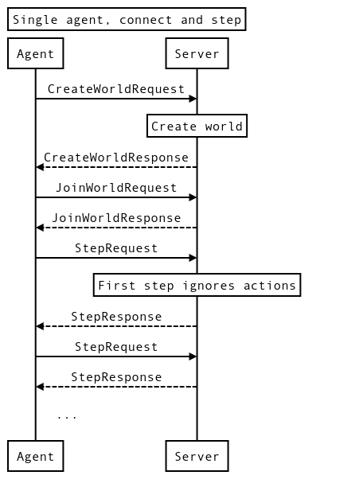
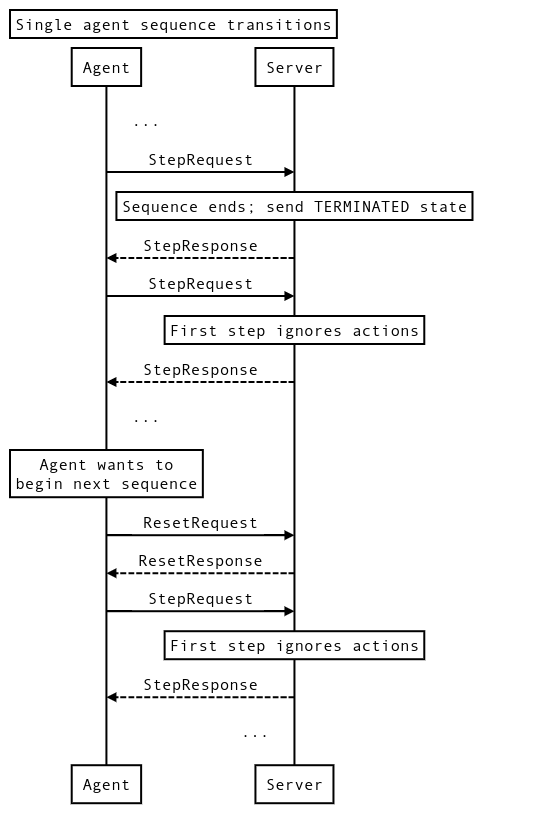
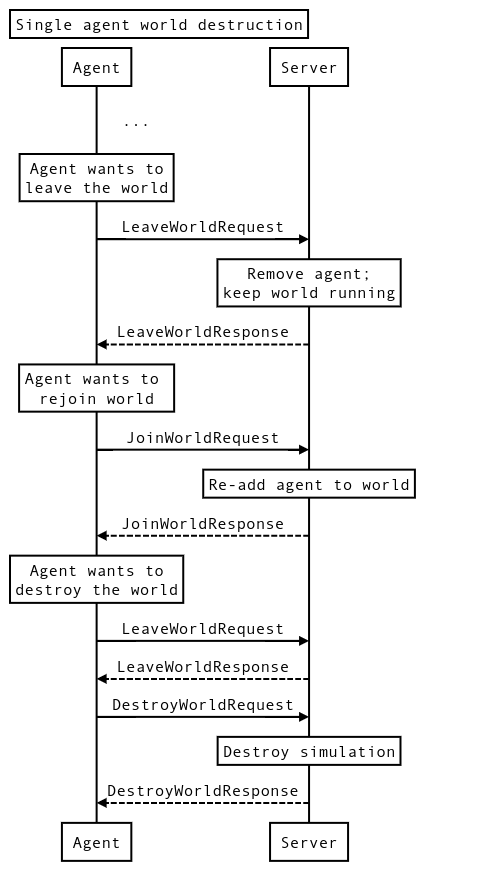

## Protocol reference

### CreateWorldRequest/Response

```protobuf
message CreateWorldRequest {
  // Settings to create the world with.  This can define the level layout, the
  // number of agents, the goal or game mode, or other universal settings.
  // Agent-specific settings, such as anything which would change the action or
  // observation spec, should go in the JoinWorldRequest.
  map<string, Tensor> settings = 1;
}
```

```protobuf
message CreateWorldResponse {
  // The unique name for the world just created.
  string world_name = 1;
}
```

`CreateWorldRequest` is responsible for creating a world with the provided
settings. In multi-agent Environments, only one call to `CreateWorldRequest` is
necessary per world, after which clients can send a `JoinWorldRequest` to join
the world.

It is not required that the same connection which creates a world also sends a
`JoinWorldRequest`. For example, a matchmaking service could call
`CreateWorldRequest` and send the `world_name` to agents over some outside
connection so they can join the new world.

The `CreateWorldResponse` returns a unique `world_name` identifier. It is up to
the server what this `world_name` should be, and in simple setups where only one
world can exist at a time it’s entirely reasonable to just leave this as empty
(the default) and throw errors on any subsequent `CreateWorldRequest` before a
`DestroyWorldRequest` is sent.

For even simpler setups a `CreateWorldRequest` may not even be needed; the
server may have hard-coded settings and just by virtue of accepting incoming
connections indicate it is waiting for agents to join.

### Multiple world support

Supporting multiple simultaneous worlds on a server is not required, though the
API does support it. For an initial server implementation it is sufficient to
only support a single world, with a `world_name` just being the empty string
(the default) and returning errors on attempts to create or access other worlds.

If multiple worlds are desired from the same server instance, they should each
be independent in the sense that an agent in one world shouldn't be able to
affect an agent in a different world.

### JoinWorldRequest/Response

```protobuf
message JoinWorldRequest {
  // The name of the world to join.
  string world_name = 1;

  // Agent-specific settings which define how to join the world, such as agent
  // name and class in an RPG.
  map<string, Tensor> settings = 2;
}
```

```protobuf
message JoinWorldResponse {
  ActionObservationSpecs specs = 1;
}
```

Requests joining an already created world with the settings provided. If
successful the client connection will be in a "joined" state, becoming an agent
and allowing future calls to `ResetRequest` and `StepRequest`. Player-specific
settings, such as race in an RTS or class in an RPG brawler, should go in these
settings. Each `JoinWorldRequest` corresponds to a different agent, and each
world will allow one or more `JoinWorldRequest`s, depending on the number of
agents it expects.

From an agent’s perspective, it may send a `StepRequest` immediately after a
`JoinWorldRequest`, however the server is free to not process the `StepRequest`
immediately and block until some condition is met, such as the correct number of
other agents joining the world or synchronizing with some external event.

The `world_name` specifies which world to join. Only one world may be joined at
a time per client connection. If an agent wants to join multiple worlds at the
same time, or join the same world as multiple agents, it will have to manage
each over a different connection.

#### Specs

The `JoinWorldResponse` has a `specs` field which provides a complete list of
available actions and observations and their shape and data type, which won’t
change until the client either leaves or resets the environment. They are keyed
by [UID](overview.md#uids), which can be used for requesting a sparse set of
observations or performing a sparse set of actions.

It’s the responsibility of the Environment to define these UIDs. There are no
specific requirements for the UIDs to be incremental or even consistent across
worlds, agents, or runs, though they should be consistent between sequences
until either `LeaveWorldRequest` or `ResetRequest` is called.

The spec names in a group, ie: actions or observations, are unique. In
principle, these are the actual keys, and the UIDs are “compiled” string keys,
for performance. It’s expected that the first thing each side of the connection
will do is map these UIDs back to their human readable strings.

### StepRequest/Response

```protobuf
message StepRequest {
  // The actions to perform on the environment.  If the environment is currently
  // in a non-RUNNING state, whether because the agent has just called
  // JoinWorld, the state from the last is StepResponse was TERMINATED or
  // INTERRUPTED, or a ResetRequest had previously been sent, the actions will
  // be ignored.
  map<uint64, Tensor> actions = 1;

  // Array of observations UIDs to return. If not set, no observations are
  // returned.
  repeated uint64 requested_observations = 2;
}
```

```protobuf
message StepResponse {
  // If state is not RUNNING, the action on the next StepRequest will be
  // ignored and the environment will transition to a RUNNING state.
  EnvironmentStateType state = 1;

  // The observations requested in `StepRequest`.  Observations returned should
  // match the dimensionality and type specified in `specs.observations`.
  map<uint64, Tensor> observations = 2;
}
```

In a `StepRequest` the client sends the map of actions and the list of
`requested_observations` UIDs. The environment performs the actions provided,
possibly steps the world forward in time, and returns the observations and
`StepType`, which defines the state of the environment.

The first step of a sequence starts in a non-running state. This might be
because the client has just joined, or because a previous sequence has finished.
When performing a step from a non-running state, the actions are ignored, the
environment is put in a running state (that is, moving on to the next sequence),
and the requested observations are returned. This allows agents to get the first
set of observations for a new sequence without providing blind actions.

As described in the [Streaming](overview.md#streaming) section, clients may send
multiple requests without waiting for their responses. Servers should process
all requests in the order they are received. Processing `StepRequests` may
change the state of the environment and transition from one sequence to the
next. In particular, note that the agent is not required to send a
`ResetRequest` to transition from one sequence to the next: any `StepRequest`
can also trigger this transition. This means that if an agent sends multilpe
step requests, some of those steps may be processed in a new sequence.

From a protocol standpoint all actions are optional, and the `StepRequest`
provides a sparse set of actions to apply. This set can even be empty. In cases
where an action isn’t optional (a move in chess, for instance, where you’re not
allowed to pass) the environment should return an error if a `StepRequest`
doesn’t provide an expected action.

#### Time

Each environment can define how it handles time during a `StepRequest`. For
discrete simulations, such as chess, the `StepRequest` may correspond to the
agent’s move, with the `StepResponse` sending back the opponent’s move. However
continuous simulations or simulations tied to real time in some way may not have
an exact mapping from time to steps or it may be ambiguous. It is up to the
environment to decide how this mapping is meant to work, and any scheme is
considered valid so long as it can be discretized to the
`StepRequest`/`StepResponse` framework with actions and observations.

It is even reasonable to define the environment so that the amount of time to
advance the simulation is an action the agent provides. This essentially allows
the agent to sleep for a set period of time, wake up, and get back requested
observations about the new state of the world. This would work even in
multi-agent environments, where the simulation could step forward in time until
the next requested wake up time for an agent, send that agent a `StepResponse`
with the current simulation state, block until the agent sends back a
`StepRequest`, and repeat.

### ResetRequest/Response

```protobuf
message ResetRequest {
  // Agents-specific settings to apply for the next sequence, such as changing
  // class in an RPG.
  map<string, Tensor> settings = 1;
}
```

```protobuf
message ResetResponse {
  ActionObservationSpecs specs = 1;
}
```

Requests the next sequence for the agent. Whereas `ResetWorldRequest` would
affect all connected agents, `ResetRequest` only affects the current agent. For
instance, in a multi-agent scenario this might cause the connection to block
until the resolution of the current sequence (until a winner is declared).

Upon successful completion of `ResetRequest` the environment will be in an
`INTERRUPTED` state. The actions on the next step request after the
`ResetRequest` will be ignored and the environment will be in a `RUNNING` state.

If the environment is already in a non-`RUNNING` state, an agent might still
send a `ResetRequest` if it wants to change settings (for instance, race in an
RTS). A `ResetRequest` without any settings when the environment is in a
non-`RUNNING` state already is a no-op (because no settings are being changed).

To allow the reset settings to change the spec, they are sent back in the
`ResetResponse`. The server will always resend the specs even if no change has
occurred.

### ResetWorldRequest/Response

```protobuf
message ResetWorldRequest {
  string world_name = 1;

  // World settings to apply for the next sequence, such as changing the map or
  // seed.
  map<string, Tensor> settings = 2;
}
```

```protobuf
message ResetWorldResponse {}
```

Requests the world identified by `world_name` start a new sequence for each
joined connection, potentially with some settings changed, such as seed. Unlike
`ResetRequest`, `ResetWorldRequest` affects all joined connections. The exact
meaning and consequences are up to the world, however the results should be
global and apply to all connected clients.

The calling connection will block until all other joined connections have sent a
`StepRequest` and a `StepResponse` was generated with an `INTERRUPTED` state.
This allows other joined connections to receive their requested observations one
last time and be told the current sequence is ending. Once all other joined
connections have stepped once the world will be considered reset and a
`ResetWorldResponse` will be sent back to the connection which issued the
`ResetWorldRequest`.

After a reset world all joined connections, including the calling connection if
it’s joined, will be in a non-`RUNNING` state. For all agents the next
StepRequest’s actions will be ignored and the next sequence will begin.

Note that unlike the other joined connections the joined connection issuing a
`ResetWorldRequest` will not receive an `INTERRUPTED` state on its next step
request and will just begin the next sequence immediately. In this way, calling
ResetWorld from a joined connection behaves similarly to Reset.

Note that a `ResetWorldRequest` does not have to come from a joined connection.
It's reasonable to have a matchmaking service observing the world and resetting
it periodically. It’s also reasonable to have a “host” joined connection which
decides to reset the world for all connected agents, or even to have each agent
decide independently when to reset the world.

### LeaveWorldRequest/Response

```protobuf
message LeaveWorldRequest {}
```

```protobuf
message LeaveWorldResponse {}
```

Requests leaving a previously joined world. The exact consequences are up to the
implementing environment, except that the connection is no longer in a joined
state. In single agent environments this may put the world back in a newly
created state, waiting for an agent to connect. In a multi-agent environment it
may block the entire simulation until another agent joins, or allow the
simulation to continue with a missing player, or terminate the simulation
entirely.

If a `LeaveWorldRequest` is received from a connection that is not currently
joined it should be a no-op.

### DestroyWorldRequest/Response

```protobuf
message DestroyWorldRequest {
  string world_name = 1;
}
```

```protobuf
message DestroyWorldResponse {}
```

Destroys the underlying world specified by `world_name`. As with the
`CreateWorldRequest`, in multi-agent environments only one `DestroyWorldRequest`
is expected, and it does not need to come from a connected agent (it could come
from some matchmaking service).

It is up to the world how to handle a `DestroyWorldRequest` if there are still
connected agents. It could block the `DestroyWorldRequest` until all agents have
sent a `LeaveWorldRequest`, immediately destroy the world and send errors back
to any further `StepRequests` from connected agents, or refuse the
`DestroyWorldRequest` and send back an error.

Sending a `DestroyWorldRequest` on a connection that is joined to the world
being destroyed should always cause the server to return an error.

### Read/Write/List Property

```protobuf
message ReadPropertyRequest {
  repeated string keys = 1;
}
```

```protobuf
message ReadPropertyResponse {
  map<string, Tensor> properties = 1;
}
```

```protobuf
message WritePropertyRequest {
  map<string, Tensor> properties = 1;
}
```

```protobuf
message WritePropertyResponse {}
```

```protobuf
message ListPropertyRequest {
  // Keys to list properties for.  Empty string is the root level.
  repeated string keys = 1;
}
```

```protobuf
message ListPropertyResponse {
  message Property {
    bool is_readable = 1;
    bool is_writeable = 2;

    // Are there listable sub attributes?
    bool is_listable = 3;

    TensorSpec spec = 4;
  }
  map<string, Property> properties = 1;
}
```

Often side-channel data is useful for debugging or manipulating the simulation
in some way which isn’t appropriate for an agent’s interface. The property
system provides this capability, and allows both reading properties and writing
data to properties.

Properties queried before a `JoinWorldRequest` will correspond to universal
properties that apply for all worlds. Properties queried after a
`JoinWorldRequest` can add a layer of world-specific properties.

For writing properties, it’s up to the World to determine if/when any
modification should take place (e.g. changing the world seed might not take
place until the next sequence).

For reading properties, the exact timing of the observation is up to the world.
It may occur at the previous step's time, or it may occur at some intermediate
time.

Properties can be laid out in a tree-like structure, as long as each node in the
tree has a unique key, by having parent nodes be listable (the `is_listable`
field in the Property message).

Although properties can be powerful, if you expect a property to be read or
written to every step by a normally functioning agent, it may be preferable to
make it a proper action or observation, even if it’s intended to be metadata.
For instance, a score which provides hidden information could be done as a
property, but it might be preferable to do it as an observation. This ensures
observations and actions all occur at well-ordered times.

### Example Sequence Diagrams: Single Agent

#### Connect and step



#### Sequence transitions



#### World destruction


